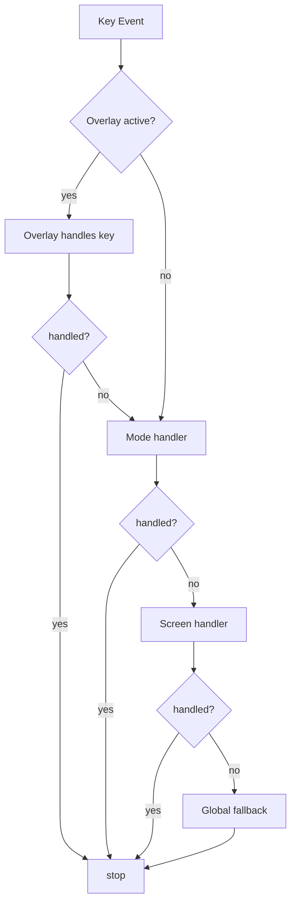

# jk Clean-Slate V1 Spec

Status: Draft

This is the concrete implementation spec for a clean-slate `jk` UI.

Companion narrative spec: `docs/clean-slate-ui-spec.md`.

## Scope

Define:

1. v1 screens and interaction model,
1. concrete default keymaps,
1. state machine diagrams,
1. MVP cutline versus v2 cutline.

## V1 Product Boundaries

V1 includes:

1. timeline-first navigation,
1. inspect loop (`show`, `diff`, `status`),
1. confirm-gated mutation execution,
1. operation-log-based recovery,
1. command palette and revset mode,
1. deterministic back/forward navigation.

V1 excludes:

1. scripting/plugin runtime,
1. mouse-driven feature parity,
1. permanent multi-pane dashboard layouts.

## Screen Set (V1)

1. `Timeline`: graph + selected revision context.
1. `Inspect`: show/diff content for selected revision.
1. `Status`: working-copy health and next-step actions.
1. `OpLog`: operation navigation and recovery actions.
1. `Revset`: revset edit/apply mode.
1. `Help`: workflow-first help + keymap screen.

Overlays (V1):

1. `ConfirmOverlay` for dangerous mutations.
1. `PromptOverlay` for required user input.
1. `PaletteOverlay` for fuzzy command launch.

## Keymaps (V1 Defaults)

### Global

1. `q`: quit app (only from `Normal` mode and no blocking overlay).
1. `:`: open command palette / command entry.
1. `Esc`: cancel current mode or close active overlay.
1. `?`: open help screen.
1. `Ctrl+o`: back.
1. `Ctrl+i`: forward.

### Normal Mode

1. `j` / `Down`: next item.
1. `k` / `Up`: previous item.
1. `PageDown`: next page (item boundary).
1. `PageUp`: previous page (item boundary).
1. `g` / `Home`: first item.
1. `G` / `End`: last item.
1. `Ctrl+d`: half-page down.
1. `Ctrl+u`: half-page up.
1. `Enter`: inspect selected revision (`show`).
1. `d`: inspect selected revision diff.
1. `s`: status screen.
1. `l`: timeline screen.
1. `o`: operation log screen.
1. `L`: revset mode.
1. `/`: search mode.

### Search Mode

1. typing: update filter/search query.
1. `Enter`: jump to first/next match.
1. `n`: next match.
1. `N`: previous match.
1. `Backspace`: delete query character.
1. `Esc`: exit search mode.

### Compose/Palette Mode

1. typing: filter command/action list.
1. `Up` / `Down`: move candidate selection.
1. `Enter`: execute selected candidate.
1. `Tab`: complete command token.
1. `Esc`: close palette and return.

### Confirm Mode

1. `y`: accept command.
1. `n`: reject command.
1. `d`: dry-run preview when available.
1. `Esc`: reject and close.

### Prompt Mode

1. typing: update prompt input.
1. `Enter`: submit prompt.
1. `Esc`: cancel prompt.

## State Model

### Core Types

1. `AppMode = Normal | Search | Compose | Confirm | Prompt`
1. `Screen = Timeline | Inspect | Status | OpLog | Help | Revset`
1. `Overlay = None | ConfirmOverlay | PromptOverlay | PaletteOverlay`
1. `Selection = Revision | Operation | None`

### Diagram: Screen and Overlay Routing

```mermaid
stateDiagram-v2
    [*] --> Timeline
    Timeline --> Inspect: Enter / d
    Timeline --> Status: s
    Timeline --> OpLog: o
    Timeline --> Revset: L
    Timeline --> Help: ?

    Inspect --> Timeline: back
    Status --> Timeline: back
    OpLog --> Timeline: back
    Help --> Timeline: back
    Revset --> Timeline: apply/cancel

    state OverlayFlow {
      [*] --> None
      None --> Palette: :
      None --> Confirm: dangerous execute
      None --> Prompt: required args
      Palette --> None: esc/apply
      Confirm --> None: y/n/esc
      Prompt --> None: submit/esc
    }
```

### Diagram: Input Dispatch Order



## Behavioral Contracts (V1)

1. Item-selectable screens must never move selection by raw line index.
1. Scroll-only screens must never render a selected-row cursor.
1. `PageUp`/`PageDown` must land on valid item boundaries.
1. Back/forward must restore screen, cursor, viewport, and revset scope.
1. Any dangerous mutation must pass through `Confirm` mode.
1. `Esc` must always move to a safer, less-committed state.

## MVP Cutline

MVP must ship all items below:

1. `Timeline`, `Inspect`, `Status`, and `OpLog` screens.
1. `Normal`, `Confirm`, and `Prompt` modes.
1. command palette with direct command execution.
1. revset edit/apply flow (even minimal autocomplete).
1. back/forward history restoration.
1. snapshot coverage for navigation and mutation confirmation paths.

MVP must not ship with known failures in:

1. `down/down/up` item navigation consistency,
1. page movement item-boundary behavior,
1. confirm-mode execution gating.

## V2 Cutline

V2 adds:

1. file details overlay with per-file actions,
1. batch multi-select actions,
1. richer revset autocomplete/signature help,
1. persistent preview strip with resize controls,
1. command macro/custom command registry,
1. advanced jump mode (ace-jump style).

V2 should preserve all MVP behavior contracts unchanged.

## Test Plan Anchors

Required snapshot suites:

1. `timeline_navigation.snap`: item selection and paging transitions.
1. `screen_history.snap`: back/forward restoration across screens.
1. `mode_transition.snap`: normal/search/compose/confirm/prompt transitions.
1. `dangerous_confirm.snap`: dangerous action accept/reject/dry-run paths.
1. `scroll_only_help.snap`: help/keymap scrolling semantics.

Required model tests:

1. selection index invariants,
1. viewport clamping,
1. history stack invariants,
1. overlay precedence and cancel semantics.

## Delivery Sequence

1. Build typed state machine and input dispatch pipeline.
1. Implement timeline + inspect with selection invariants.
1. Implement confirm/prompt overlays with mutation gating.
1. Implement op log + recovery flow.
1. Add command palette and revset mode.
1. Finalize help/tutorial and polish keymap language.
